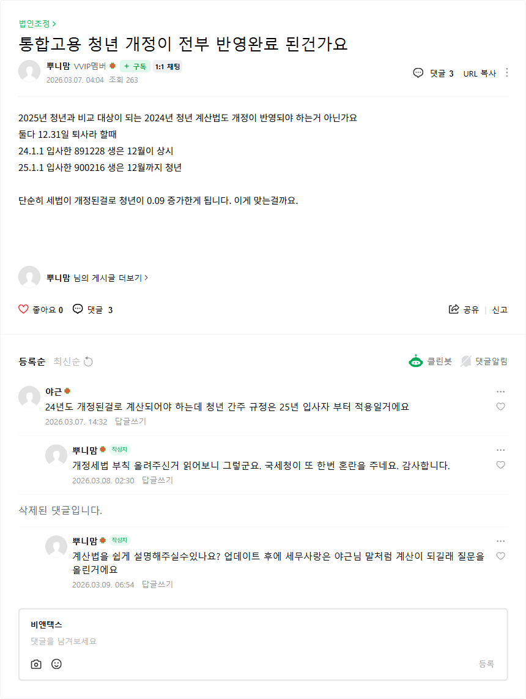
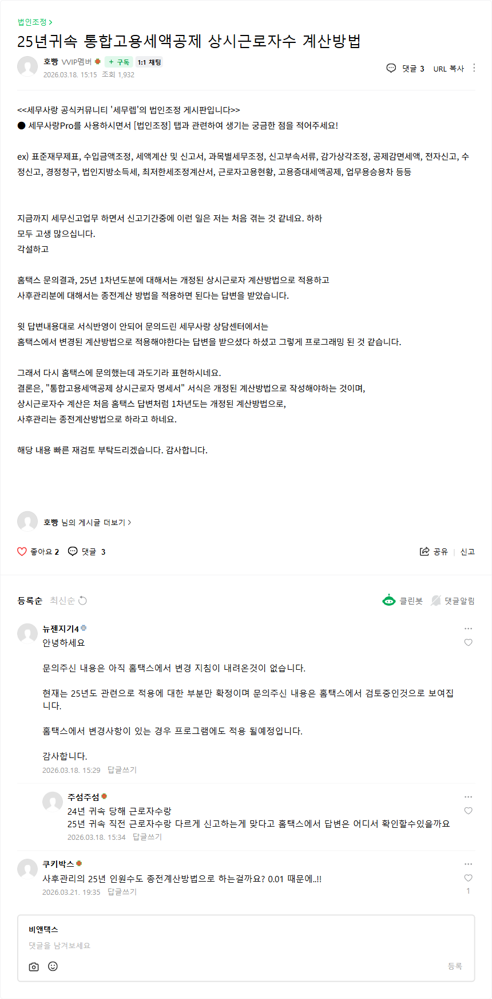

# 통합고용증대세액공제 개정 사항 정리

- **출처**: 네이버 카페 [세무렙 - 한국세무사회 세무사랑Pro & 케이렙 공식 카페](https://cafe.naver.com/semusarangkclep) > 법인조정 게시판
- **확인일**: 2026-09-01
- **참고**: 두 글 모두 카페지기 공식 공지가 아닌 **회원 질문글 + 답변(댓글)** 형태입니다. 실무 적용 시 국세청/홈택스 공식 지침을 재확인하세요.

---

## 1. 청년 연령 간주 규정 — 25년 입사자부터 적용

**원문**: [통합고용 청년 개정이 전부 반영완료 된건가요](https://cafe.naver.com/f-e/cafes/29179359/articles/61072) (2026.03.07.)

### 질문 요지
- 2025년 청년과 비교 대상이 되는 **2024년 청년 계산법에도 개정이 반영되어야 하는지** 문의
- 제시된 사례 (둘 다 12.31. 퇴사 가정)
  - 24.1.1. 입사한 891228생 → 12월이 **상시**
  - 25.1.1. 입사한 900216생 → 12월까지 **청년**
- 단순히 세법이 개정된 것만으로 청년 인원이 **0.09 증가**하는 결과 발생

### 답변 (댓글)
> 24년도 개정된 걸로 계산되어야 하는데 **청년 간주 규정은 25년 입사자부터 적용**일 거예요

- 작성자 확인: "개정세법 부칙 올려주신 거 읽어보니 그렇군요."

---

## 2. 상시근로자수 계산방법 — 1차년도 vs 사후관리 적용 구분

**원문**: [25년귀속 통합고용세액공제 상시근로자수 계산방법](https://cafe.naver.com/f-e/cafes/29179359/articles/61423) (2026.03.18.)

### 홈택스 문의 결과
| 구분 | 적용 계산방법 |
| --- | --- |
| 25년 **1차년도분** | **개정된** 상시근로자 계산방법 |
| **사후관리분** | **종전** 계산방법 |

- 단, **"통합고용세액공제 상시근로자 명세서" 서식 자체는 개정된 계산방법으로 작성**해야 함
- 세무사랑 상담센터는 "홈택스에서 변경된 계산방법으로 적용해야 한다"는 답변을 받아 그대로 프로그래밍된 것으로 보임
- 홈택스는 현 상황을 **"과도기"** 로 표현

### 세무사랑(뉴젠) 측 댓글
> 문의주신 내용은 아직 홈택스에서 변경 지침이 내려온 것이 없습니다. 현재는 25년도 관련으로 적용에 대한 부분만 확정이며, 문의주신 내용은 홈택스에서 검토 중인 것으로 보입니다. 홈택스에서 변경사항이 있는 경우 프로그램에도 적용될 예정입니다.

### 미해결 쟁점 (댓글에서 제기)
- 24년 귀속 당해 근로자수와 25년 귀속 직전 근로자수를 다르게 신고하는 것이 맞는지 확인할 근거
- 사후관리의 25년 인원수도 종전 계산방법을 적용하는지

---

## 요약

1. **청년 간주 규정**은 2025년 입사자부터 적용 → 2024년 비교 대상 계산에는 소급 적용되지 않음
2. **상시근로자수 계산**은 1차년도(개정) / 사후관리(종전)로 나뉘되, 서식 작성은 개정 기준 → 홈택스 지침이 아직 정리되지 않은 과도기 상태
